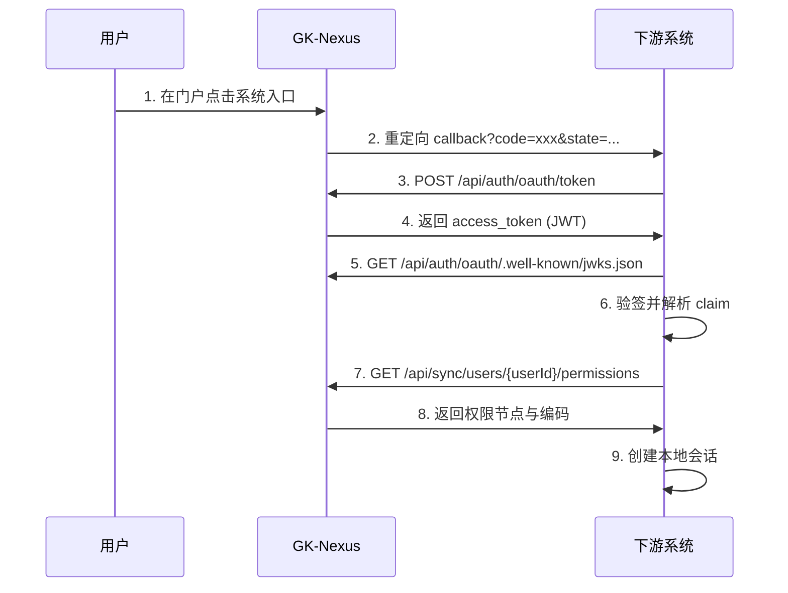

# 国库业务系统 OAuth 与同步接口对接指南（基于最新代码）

> 本文档为子系统接入 GK-Nexus OAuth2.0 单点登录提供技术指导

---

## 1. 对接目标与改造边界

### 1.1 目标

- 统一身份：用户身份由 GK-Nexus 统一管理。
- 统一登录：下游系统通过 OAuth2.0 授权码模式接入单点登录。
- 统一授权：权限由 GK-Nexus 管理，下游通过同步接口实时拉取。
- 审计追溯：保留用户、系统、权限、映射关系变更链路。

### 1.2 改造边界建议

- 停用下游系统独立登录入口。
- 停用下游本地密码认证作为主认证方式。
- 保留下游本地鉴权逻辑，但权限数据来源改为 GK-Nexus 同步接口。
- 保留下游业务数据访问控制，按下游业务规则执行。

---

## 2. 访问路径与路由约定

### 2.1 网关与 BFF 路由

当前代码路由结构如下：

- Gateway 将 `/auth/**` 转发到 `gk-auth`，将 `/system/**` 转发到 `gk-system`。
- BFF 提供对外统一前缀 `/api`。
- BFF 将 `/api/auth/oauth/*` 代理到 Gateway 的 `/auth/oauth/*`。
- BFF 将 `/api/*`（排除 `/api/auth/*`）代理到 Gateway 对应后端。

因此，对外推荐访问路径：

- OAuth 授权/换 token/JWKS：`/api/auth/oauth/*`
- 同步接口：`/api/sync/*`（由 BFF 去掉 `/api` 后转发到后端）

### 2.2 核心接口清单

| 能力 | 方法 | 推荐对外路径（经 BFF） | Gateway 侧路径 |
|:---|:---|:---|:---|
| 授权码入口 | GET | `/api/auth/oauth/authorize` | `/auth/oauth/authorize` |
| 换取 token | POST | `/api/auth/oauth/token` | `/auth/oauth/token` |
| JWKS 公钥 | GET | `/api/auth/oauth/.well-known/jwks.json` | `/auth/oauth/.well-known/jwks.json` |
| 用户有效权限 | GET | `/api/sync/users/{userId}/permissions` | `/system/api/sync/users/{userId}/permissions` |
| 权限定义 | GET | `/api/sync/permissions` | `/system/api/sync/permissions` |
| 角色定义 | GET | `/api/sync/roles` | `/system/api/sync/roles` |
| 用户定义 | GET | `/api/sync/users` | `/system/api/sync/users` |
| 角色-权限关系 | GET | `/api/sync/role-permissions` | `/system/api/sync/role-permissions` |
| 用户-角色关系 | GET | `/api/sync/user-roles` | `/system/api/sync/user-roles` |

---

## 3. OAuth2.0 授权码接入

### 3.1 流程图



### 3.2 授权请求

```http
GET /api/auth/oauth/authorize?client_id=DWBI_ER&redirect_uri=http://er.example.com/oauth/callback&response_type=code&scope=profile%20permissions&state=abc123
```

说明：

- `response_type` 当前仅支持 `code`。
- 未登录用户会被重定向至 `/login?redirect_to=...`。
- `redirect_uri` 必须与已注册回调地址匹配（代码中支持等价 URI 归一化匹配）。

### 3.3 token 请求

授权码模式：

```bash
curl -X POST "http://localhost:3000/api/auth/oauth/token" \
  -H "Content-Type: application/x-www-form-urlencoded" \
  -d "grant_type=authorization_code" \
  -d "code=YOUR_CODE" \
  -d "client_id=DWBI_ER" \
  -d "client_secret=YOUR_CLIENT_SECRET" \
  -d "redirect_uri=http://er.example.com/oauth/callback"
```

系统态模式（用于批量同步任务）：

```bash
curl -X POST "http://localhost:3000/api/auth/oauth/token" \
  -H "Content-Type: application/x-www-form-urlencoded" \
  -d "grant_type=client_credentials" \
  -d "client_id=DWBI_ER" \
  -d "client_secret=YOUR_CLIENT_SECRET" \
  -d "scope=sync"
```

成功响应示例：

```json
{
  "access_token": "<JWT_TOKEN>",
  "token_type": "Bearer",
  "expires_in": 3600,
  "scope": "sync"
}
```

说明：

- 授权码模式返回 `access_token`、`token_type`、`expires_in`。
- `client_credentials` 模式额外返回 `scope`。

---

## 4. JWT 与 JWKS

### 4.1 JWKS 接口

```http
GET /api/auth/oauth/.well-known/jwks.json
```

返回示例：

```json
{
  "keys": [
    {
      "kty": "RSA",
      "kid": "gk-nexus-key-1",
      "use": "sig",
      "alg": "RS256",
      "n": "...",
      "e": "AQAB"
    }
  ]
}
```

### 4.2 关键 claim（以当前代码为准）

授权码 token 主要包含：

- `sub`（统一用户 ID）
- `username`
- `name`
- `client_id`
- `scope`
- `org_id`、`org_name`
- `dept_id`、`dept_name`
- `iat`、`exp`

系统态 token 主要包含：

- `sub`（值为 `client_id`）
- `client_id`、`client_name`
- `scope`
- `grant_type=client_credentials`
- `token_use=system_sync`

### 4.3 验签要求

- 下游必须先验签再使用 claim，不允许“只解码不验签”。
- 建议按 JWT Header 的 `kid` 精确匹配 JWKS key。
- 验签失败、过期、格式非法统一按未登录处理（401）。

---

## 5. 权限同步接口

### 5.1 用户权限接口

```http
GET /api/sync/users/{userId}/permissions?sysCode=DWBI_ER
Authorization: Bearer {access_token}
```

响应外层统一结构：

```json
{
  "code": 200,
  "message": "操作成功",
  "data": { },
  "success": true
}
```

`data` 结构（关键字段）：

- `sysCode`、`userId`
- `permissionCodes`（兼容字段）
- `menuIds`（兼容字段）
- `grantedLocalPermissionCodes`（推荐新字段）
- `grantedPortalMenuIds`（推荐新字段）
- `permissions`（扁平权限节点）
- `schemaVersion`（当前为 `permission-sync-v4`）
- `generatedAt`（ISO 8601 时间）

### 5.2 权限定义接口

```http
GET /api/sync/permissions?sysCode=DWBI_ER
Authorization: Bearer {access_token}
```

说明：

- 返回指定系统全量权限定义，结构与用户权限接口一致。
- `permissions` 为扁平数组，下游需按 `parentId` 自行组装树。
- `type` 统一模型：`DIRECTORY`、`MENU`、`BUTTON`、`DATA`。
- `dataScope` 仅在 `type=DATA` 时有意义；`attributes` 为扩展字段容器。

### 5.3 权限节点关键别名

为兼容旧客户端，接口保留旧字段并提供语义更清晰别名：

- `id` <=> `portalPermissionId`
- `parentId` <=> `portalParentPermissionId`
- `code` <=> `localPermissionCode`
- `key` <=> `portalNodeKey`

新客户端建议优先消费别名字段。

---

## 6. 全量/增量同步与令牌策略

### 6.1 全量同步接口

```http
GET /api/sync/roles?sysCode=DWBI_ER
GET /api/sync/users?sysCode=DWBI_ER
GET /api/sync/role-permissions?sysCode=DWBI_ER
GET /api/sync/user-roles?sysCode=DWBI_ER
GET /api/sync/permissions?sysCode=DWBI_ER
Authorization: Bearer {access_token}
```

当前代码策略：

- 上述 5 个接口强制要求系统态 token（`grant_type=client_credentials` 或 `token_use=system_sync`）。

### 6.2 增量同步接口

```http
GET /api/sync/roles/changes?sysCode=DWBI_ER&sinceVersion=455
GET /api/sync/permissions/changes?sysCode=DWBI_ER&sinceVersion=455
GET /api/sync/user-roles/changes?sysCode=DWBI_ER&sinceVersion=455
GET /api/sync/users/changes?sysCode=DWBI_ER&sinceVersion=455
GET /api/sync/role-permissions/changes?sysCode=DWBI_ER&sinceVersion=455
Authorization: Bearer {access_token}
```

返回 `data` 结构：

- `sinceVersion`
- `currentVersion`
- `hasMore`
- `records[]`

`records[]` 元素字段：

- `version`
- `entityType`
- `entityId`
- `localEntityCode`
- `changeType`（如 `CREATED`、`UPDATED`、`DELETED`、`ASSIGNED`）
- `occurredAt`
- `payload`

### 6.3 Webhook Hint + Pull 混合模式

门户发生变更后，会向下游 `base_url` 推送轻量通知：

```http
POST {base_url}/internal/nexus/sync-events
Content-Type: application/json
```

请求体示例：

```json
{
  "eventType": "SYNC_HINT",
  "sysCode": "DWBI_ER",
  "entityType": "ROLE",
  "entityId": "123",
  "localEntityCode": "ROLE_ADMIN",
  "changeType": "UPDATED",
  "version": 456,
  "occurredAt": "2026-04-26T09:30:00+08:00"
}
```

下游接入建议：

- 接收端点收到后立即返回 200，不在请求线程内做重同步。
- 将 `version` 入队，由异步任务调用 `/changes` 拉取明细。
- 即使有 webhook，也要保留定时增量轮询兜底（建议 5-10 分钟）。

---

## 7. 用户上下文接口

```http
GET /api/sync/users/{userId}/context
Authorization: Bearer {access_token}
```

返回 `data` 关键字段：

- `id`、`username`、`name`
- `subjectCode`、`subjectName`
- `orgId`、`orgName`
- `deptId`、`deptName`
- `userType`
- `adminScopeType`、`adminSysCode`
- `status`、`email`、`phoneNumber`

---

## 8. 下游系统配置建议

```yaml
gk-nexus:
  oauth:
    authorize-url: http://gk-nexus-bff:3000/api/auth/oauth/authorize
    token-url: http://gk-nexus-bff:3000/api/auth/oauth/token
    jwks-url: http://gk-nexus-bff:3000/api/auth/oauth/.well-known/jwks.json
    permission-url: http://gk-nexus-bff:3000/api/sync/users/{userId}/permissions
    client-id: ${NEXUS_CLIENT_ID:DWBI_ER}
    client-secret: ${NEXUS_CLIENT_SECRET_DWBI_ER}
    redirect-uri: http://er.example.com/oauth/callback
```

注意：

- `client-secret` 必须通过环境变量/配置中心注入，不可硬编码。
- 生产环境必须使用 HTTPS。
- 多系统接入必须“一系统一 client-id/client-secret”。

---

## 9. 联调最小检查清单

1. OAuth Client 已在 GK-Nexus 注册，回调地址与下游一致。
2. 授权码流程可拿到 `access_token`。
3. 下游可通过 JWKS 验签，且校验 `exp`。
4. 下游可调用用户权限接口并正确解析 `permissions` 扁平节点。
5. 下游已实现 `/internal/nexus/sync-events`，且异步拉取 `/changes`。
6. 下游已配置全量+增量同步任务与版本游标持久化。

---

*文档版本: v2.0*  
*更新时间: 2026-04-26*  
